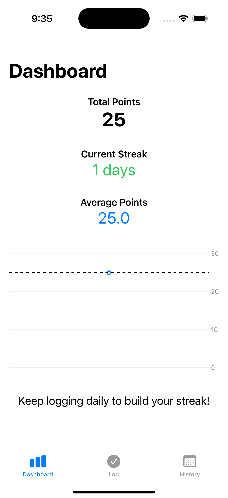
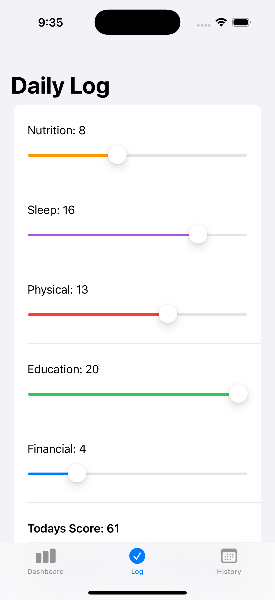
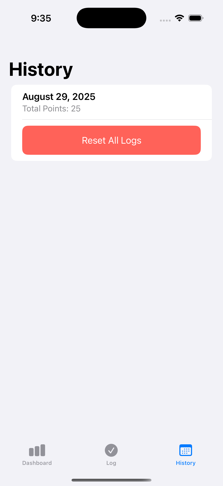

# Discipline Tracker

## About this Project

This is my first ever basic Swift project which I essentially completed in less than a day with the help of AI.

Before starting this project I had never even touched swift. Of course I understood what was going on line by line but I had never 
seen the syntax before today. AI literally wrote about 90% of this code, all I had to do was stitch it together.

Maybe this project will be considered by some "Not my real work" but I believe it's not about that.

This project is proof that this industry will DRASTICALLY change in the comming few years. If I (someone who has never used swift before)
can create a reasonable looking app in literally a few hours with the help of AI, then it is proof that certain jobs are done for, considering 
how much money companies can save by simply having an enterprise subscription to ChatGPT, let alone all of the other LLMs they can get their
hands on.

Like it or not, one day I will use these tools to start my own company, it seems stupid not to try given how powerful they are.

## Features

- Once a day log 5 categories of your life on a scale of 0/20 for a total of 100 points per day.
- Daily logs will be plotted on a graph on your dashboard.
- View your streak and average points to see your "Discipline Progress".
- Look in the history tab to view all of your logs or even delete them.

## Images

